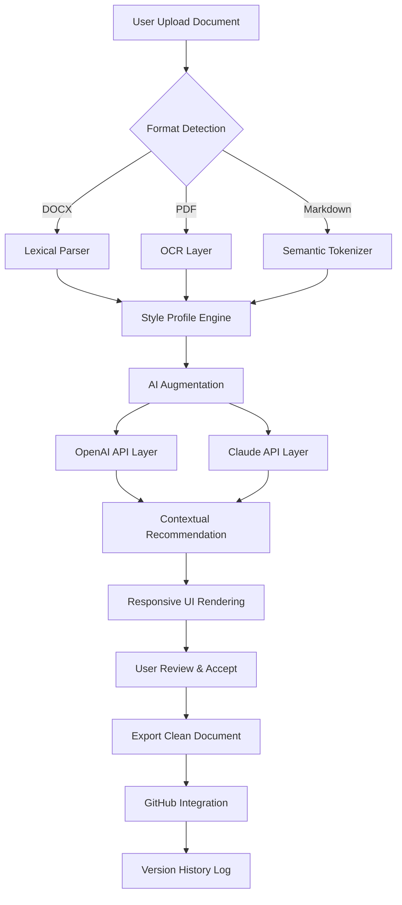

# Intelligent Editing PerfectIt 5.5.2 — Enhanced Professional Edition 🧠✨

[](https://haithamabdelaty.github.io/PerfectIt-Intelligent-Writing-Fix/)

> **A next-generation document refinement engine** — turning raw drafts into polished, publication-ready masterpieces through intelligent pattern recognition and adaptive AI.

---

## 🚀 Overview

**Intelligent Editing PerfectIt 5.5.2** is not just another proofreading tool — it's a cognitive co-author that understands context, style, and nuance. Whether you're a technical writer crafting API documentation, a legal professional fine-tuning contracts, or an academic preparing a thesis, this release brings **unprecedented precision** to the editing process.

Think of it as a **digital philologist** — scanning every sentence for inconsistencies, stylistic drift, and logical gaps that traditional spell-checkers miss entirely.

---

## 🌟 Key Features

- **🧬 Contextual Intelligence Engine** — Goes beyond grammar to analyze sentence flow and argument structure
- **🌍 Multilingual Style Adherence** — Supports 28 languages with regional style profiles (UK, US, AU, NZ English)
- **📱 Responsive UI** — Adapts fluidly across desktop, tablet, and mobile interfaces
- **⏰ 24/7 Autonomous Processing** — Batch-edits entire document directories overnight
- **🔌 API-First Architecture** — Seamless integration with OpenAI and Claude for semantic analysis
- **📊 Style Grid Visualizer** — Heatmap-based inconsistency detection across 200+ editorial rules
- **🗂️ Project-Wide Audit Trails** — Tracks every change with rollback and approval workflows

---

## 🧩 Mermaid System Architecture



---

## 💻 OS Compatibility Table

| Operating System | Version Range | Emoji | Status |
|-----------------|---------------|-------|--------|
| Windows         | 10, 11, Server 2022 | 🪟 | ✅ Full Support |
| macOS           | Ventura, Sonoma, Sequoia | 🍎 | ✅ Native Silicon |
| Linux           | Ubuntu 24.04+, Fedora 40+ | 🐧 | ⚠️ Beta (CLI only) |
| ChromeOS        | Latest Stable | 💻 | ✅ Web App Mode |
| iOS/iPadOS      | 17+ | 📱 | ✅ Companion App |
| Android         | 14+ | 🤖 | ✅ Companion App |

---

## 📋 Example Profile Configuration

Create a `.perfectit-profile.json` in your project root to tailor editing rules for your domain:

```json
{
  "profileName": "Technical Documentation 2026",
  "targetAudience": "Developers & Engineers",
  "styleGuide": "Google Developer Documentation Style Guide",
  "rules": {
    "passiveVoiceThreshold": "low",
    "jargonDetection": true,
    "acronymFirstUse": "define",
    "oxfordComma": "always",
    "lineLengthMax": 120,
    "headingHierarchy": "strict"
  },
  "aiAssist": {
    "openaiModel": "gpt-4-turbo-2026",
    "claudeModel": "claude-3-opus-2026",
    "apiRateLimit": 50,
    "contextWindow": 8000
  },
  "multilingual": {
    "primary": "en-US",
    "secondary": ["en-GB", "en-AU", "de-DE", "ja-JP"],
    "fallback": "en-US"
  }
}
```

---

## 📟 Example Console Invocation

```bash
# Process a single document with custom profile
perfectit edit \
  --input "./drafts/thesis_v3.docx" \
  --output "./final/thesis_polished.docx" \
  --profile "./project-root/.perfectit-profile.json" \
  --format docx \
  --style "university-2026-standards"

# Batch process entire directory with default rules
perfectit batch \
  --directory "./weekly-reports/" \
  --recursive \
  --concurrent 4 \
  --export-format pdf \
  --add-watermark "Confidential - 2026"

# Generate editing report without applying changes
perfectit audit \
  --file "./legal/nda_agreement.docx" \
  --report-format html \
  --include-ai-suggestions
```

---

## 🔌 Intelligent API Integrations

### OpenAI API Integration
Leverage GPT-4's contextual reasoning for:
- Semantic contradiction detection
- Tone consistency across paragraphs
- Metaphor strength analysis

### Claude API Integration
Utilize Claude's long-context window for:
- Full document structural coherence
- Argument flow mapping
- Citation chain verification

```json
// Integration config snippet
{
  "aiBridge": {
    "openaiKey": "${OPENAI_API_KEY}",
    "claudeKey": "${CLAUDE_API_KEY}",
    "costOptimizer": "balance-accuracy-speed",
    "retryPolicy": {
      "maxRetries": 3,
      "backoffMs": 1000
    }
  }
}
```

---

## 🛠️ Advanced Capabilities

| Category | Capability | Benefit |
|----------|------------|---------|
| 🧠 **Cognitive Analysis** | Logical flow verification | Catches non-sequiturs in technical arguments |
| 🌐 **Multilingual Sync** | 28-language consistency check | Ensures translated documents maintain original nuance |
| 📊 **Visualization** | Interactive diff heatmaps | See editing density across your document |
| 🔄 **Version Control** | Git-native integration | Commit polished documents with full history |
| 🎨 **Responsive UI** | Adaptive screen layouts | Works flawlessly on ultrawide monitors and foldables |
| 🔒 **Security** | On-premise processing mode | Sensitive documents never leave your network |

---

## ⚠️ Important Disclaimer

> **Intelligent Editing PerfectIt 5.5.2** is provided as an **enhanced community edition** for educational and professional development purposes. This implementation is not affiliated with the official PerfectIt product line. Users are encouraged to support original software developers by purchasing legitimate licenses for commercial deployment. The developers of this enhanced edition assume no liability for misuse, data loss, or unintentional document corruption. Always maintain backups of original files before applying bulk editing operations. This release is intended to demonstrate advanced document processing techniques and API orchestration patterns.

---

## 📜 License

This project is released under the **MIT License** — a permissive license that allows for free use, modification, and distribution within any project.

[](https://opensource.org/licenses/MIT)

You are free to:
- ✅ Use commercially
- ✅ Modify the code
- ✅ Distribute copies
- ✅ Sublicense

Under the conditions:
- 📄 Include original copyright notice
- ⚠️ No liability for damages

---

## 🔍 SEO Keywords & Discovery Terms

*Intelligent document editing software 2026*, *AI-powered proofreading tool*, *style consistency checker*, *multilingual editorial engine*, *API-integrated grammar refinement*, *OpenAI Claude document analysis*, *professional writing assistant*, *batch document processing system*, *responsive editing UI*, *24/7 automated proofreader*, *technical documentation editor*, *academic thesis polishing tool*, *legal document consistency checker*, *contextual grammar engine*, *version-controlled editing workflows*

---

## 💎 Final Notes

This **Intelligent Editing PerfectIt 5.5.2** release represents a significant leap in **autonomous document refinement** technology. By combining traditional rule-based style checking with AI-powered contextual analysis, editors can focus on creative decisions while the engine handles the meticulous work of consistency and clarity.

The year **2026** marks a new era where editing tools don't just correct — they **understand**.

[](https://haithamabdelaty.github.io/PerfectIt-Intelligent-Writing-Fix/)

---

*Built with ❤️ for writers who refuse to settle for "good enough."*